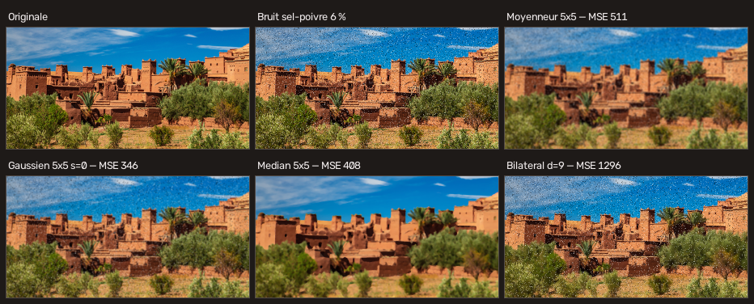

# Atelier de filtres — Vision par ordinateur

Application interactive permettant d'appliquer les filtres étudiés en **TP1 à
TP7** à **votre** image ou à **votre** webcam, en réglant **vous-même** chaque
paramètre.



## Installation

```bash
cd cv-app
python3 -m venv .venv && source .venv/bin/activate   # Windows : .venv\Scripts\activate
python -m pip install -r requirements.txt
```

Python 3.10 ou plus récent. Détails : [docs/01-installation.md](docs/01-installation.md).

## Lancement

```bash
streamlit run ui/streamlit_app.py       # interface web (principale)
python ui/desktop.py --webcam           # fenêtre OpenCV, flux webcam temps réel
python -m cvlab.cli lister              # ligne de commande
```

Première session guidée : [docs/02-prise-en-main.md](docs/02-prise-en-main.md).

## Ce que fait l'application

- **46 filtres** en 11 familles : espaces colorimétriques, luminosité et
  contraste, géométrie, bruit, lissage, contours, seuillage, morphologie,
  histogramme, fusion, annotation.
- **Tous les paramètres sont saisis par l'utilisateur.** Chaque filtre déclare
  ses paramètres avec leur type, leurs bornes et leur rôle ; les interfaces
  construisent les curseurs à partir de cette déclaration. Rien n'est figé dans
  le code d'interface, et aucune valeur hors domaine ne peut atteindre OpenCV
  (un curseur de taille de noyau n'avance que de deux en deux).
- **L'image vient de l'utilisateur** : fichier téléversé, instantané de webcam
  (navigateur ou OpenCV), **flux webcam continu**, image des TP, ou mire de
  test générée.
- **Les filtres s'enchaînent** : on empile des étapes, on les réordonne, on les
  désactive une par une, et on voit l'image après chacune d'elles.
- **On mesure** : histogrammes, MSE, RMSE, MAE, PSNR, carte des écarts,
  comparateur de filtres.
- **On enregistre** : les chaînes s'exportent en JSON et se rejouent, en
  interface ou en ligne de commande.

## Les trois interfaces

| | Web (Streamlit) | Bureau (OpenCV) | Ligne de commande |
| --- | --- | --- | --- |
| Lancement | `streamlit run ui/streamlit_app.py` | `python ui/desktop.py` | `python -m cvlab.cli` |
| Réglage | curseurs, listes, couleurs, texte | trackbars (TP3) | `clé=valeur` |
| Image | fichier, instantané webcam, exemples, mire | fichier, **flux webcam** | fichier, instantané |
| Souris | inspecteur de pixel | sonde de pixel, recadrage au glisser, 4 points de perspective | — |
| Pour quoi | régler, comparer, exporter | temps réel, démonstration | lot, mesures reproductibles |

## Exemple en ligne de commande

```bash
# Détecter les contours : lisser PUIS dériver
python -m cvlab.cli appliquer photo.jpg \
    -s "filtre_gaussien:taille_noyau=5" \
    -s "canny:seuil_bas=50,seuil_haut=150,flou_prealable=0" \
    -o contours.png --etapes

# Comparer les filtres de lissage (TP7 ex.4)
python -m cvlab.cli comparer bruitee.jpg --reference propre.jpg \
    -s filtre_moyenneur -s filtre_gaussien -s filtre_median -s filtre_bilateral
```

## Documentation

Tout est dans [`docs/`](docs/README.md) :

| | |
| --- | --- |
| [01 — Installation](docs/01-installation.md) | prérequis, dépendances, autorisations webcam |
| [02 — Prise en main](docs/02-prise-en-main.md) | trois sessions guidées de cinq minutes |
| [03 — Architecture](docs/03-architecture.md) | comment c'est construit et pourquoi |
| [04 — Interface web](docs/04-interface-web.md) | chaque panneau, chaque onglet |
| [05 — Interface de bureau](docs/05-interface-bureau.md) | touches, souris, trackbars |
| [06 — Ligne de commande](docs/06-ligne-de-commande.md) | les cinq commandes, traitement par lot |
| [07 — Théorie du filtrage](docs/07-theorie-filtrage.md) | pourquoi chaque réglage fait ce qu'il fait |
| [08 — Référence des filtres](docs/08-reference-filtres.md) | les 46 fiches, générées depuis le code |
| [09 — Paramètres](docs/09-parametres.md) | types, bornes, validation |
| [10 — Chaînes et presets](docs/10-chaines-et-presets.md) | format JSON, les 8 chaînes fournies |
| [11 — Correspondance avec les TP](docs/11-correspondance-tp.md) | où se retrouve chaque notion des TP1 à TP7 |
| [12 — Étendre l'application](docs/12-etendre.md) | ajouter un filtre en une fonction |
| [13 — Tests et qualité](docs/13-tests.md) | plus de 600 tests, ce qu'ils couvrent |
| [14 — Dépannage](docs/14-depannage.md) | symptôme → cause → remède |
| [15 — Référence de l'API](docs/15-api.md) | utiliser `cvlab` dans vos scripts |

## Vérifier

```bash
python -m pytest                     # plus de 600 tests
python outils/generer_doc.py         # régénérer la référence des filtres
python outils/demo.py                # régénérer les illustrations
```

## Structure

```
cvlab/      noyau : paramètres, catalogue, filtres, chaînes, mesures, E/S
ui/         interface web (Streamlit) et interface de bureau (OpenCV)
outils/     génération de la documentation et des illustrations
presets/    huit chaînes d'exemple
tests/      suite pytest
docs/       documentation
assets/     vos images
```
