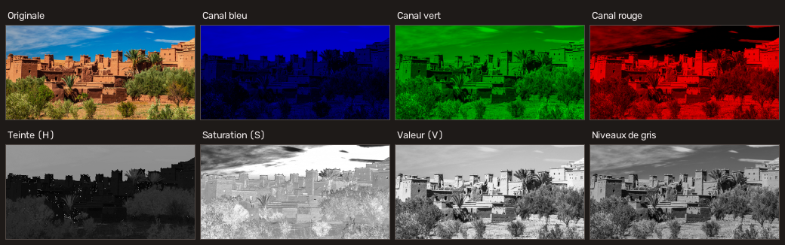
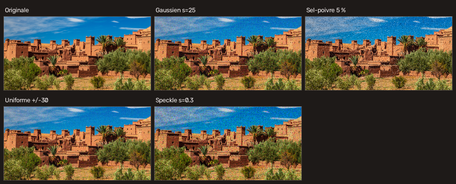
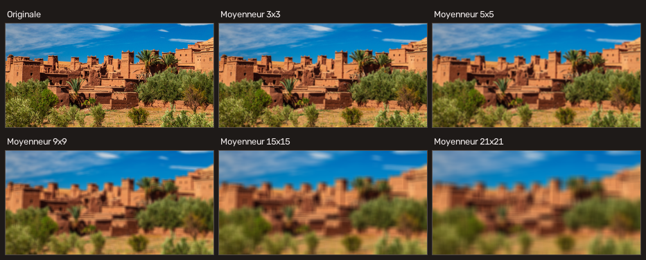
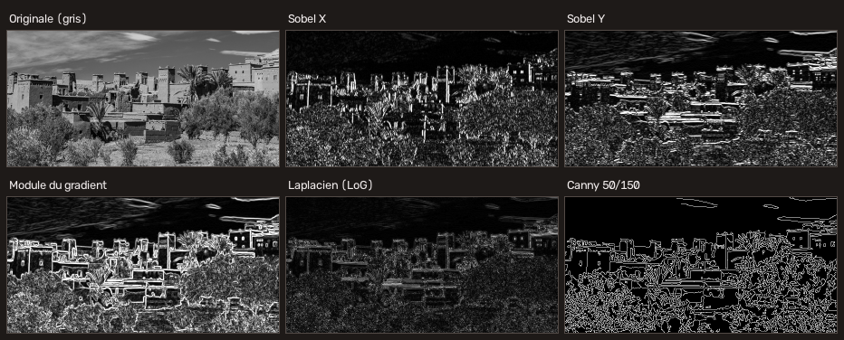
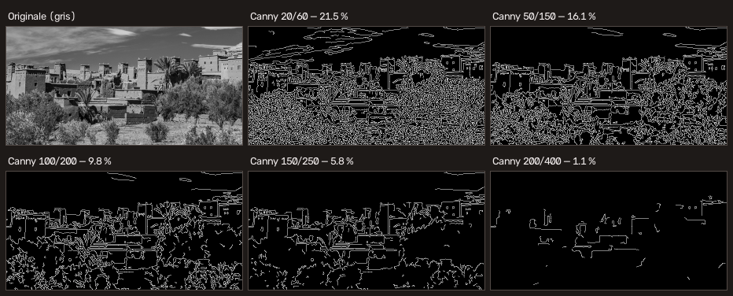
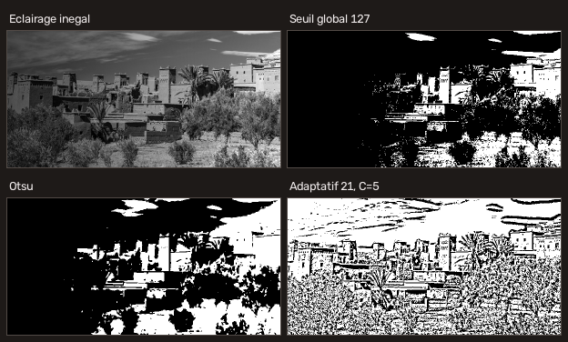
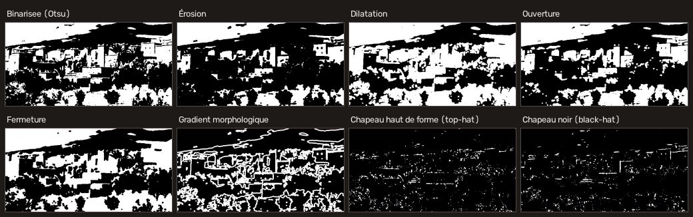
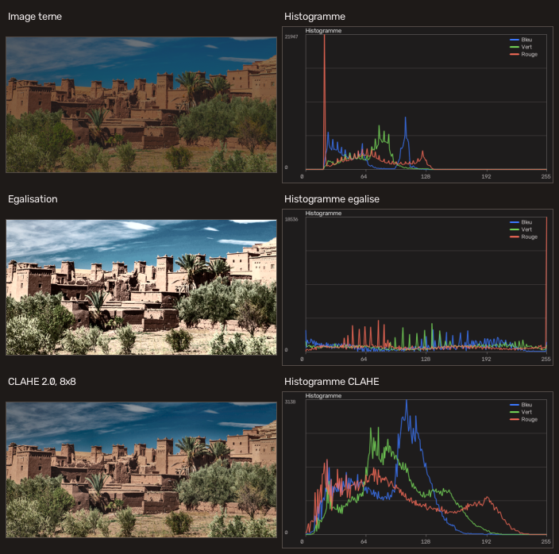
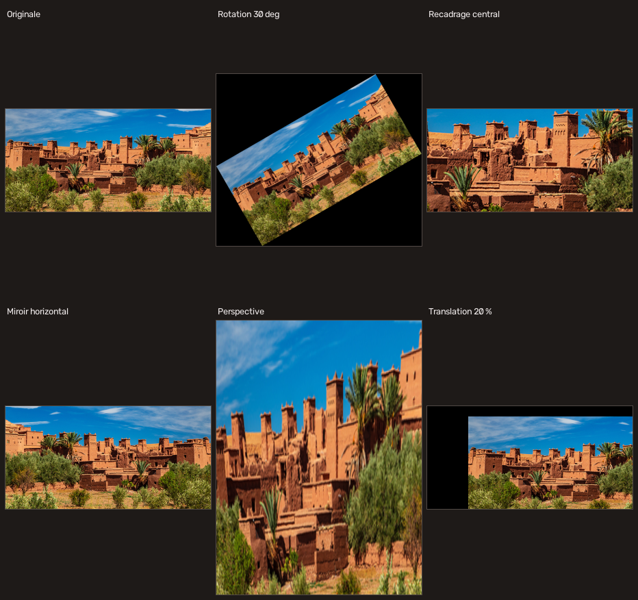

# 07 — Théorie du filtrage

Ce chapitre explique *pourquoi* chaque réglage produit l'effet observé. Il suit
la progression des TP. Pour la fiche technique d'un filtre précis, voir
[08 — Référence des filtres](08-reference-filtres.md).

- [1. L'image numérique](#1-limage-numérique)
- [2. Opérations ponctuelles](#2-opérations-ponctuelles)
- [3. La convolution](#3-la-convolution)
- [4. Le bruit](#4-le-bruit)
- [5. Lissage et débruitage](#5-lissage-et-débruitage)
- [6. Dérivées et contours](#6-dérivées-et-contours)
- [7. Seuillage](#7-seuillage)
- [8. Morphologie mathématique](#8-morphologie-mathématique)
- [9. Histogramme](#9-histogramme)
- [10. Géométrie](#10-géométrie)
- [11. Fusion et opérations binaires](#11-fusion-et-opérations-binaires)
- [12. Mesurer un résultat](#12-mesurer-un-résultat)

---

## 1. L'image numérique

*(TP2 §1)*

Une image est une grille de **pixels**. L'origine (0, 0) est en **haut à
gauche** ; x indexe les colonnes, y les lignes. En NumPy l'ordre est inversé :
`image[y, x]` — c'est la source d'erreur la plus courante, puisque les
fonctions de dessin d'OpenCV prennent, elles, des points `(x, y)`.

Chaque pixel d'une image couleur 24 bits porte trois octets. OpenCV les range
dans l'ordre **B, G, R** — et non R, G, B comme la plupart des bibliothèques
d'affichage. Afficher une image OpenCV avec Matplotlib ou Streamlit sans
conversion donne une image aux rouges et bleus inversés. Dans cette
application, la conversion est centralisée dans `cvlab.images.to_rgb`.

Une image à **un seul canal** n'a pas de couleur : une valeur unique ne peut
représenter qu'une intensité. C'est ce qu'on appelle les niveaux de gris.

### L'espace HSV

*(TP2 §1.3)*

HSV décrit une couleur par trois grandeurs plus intuitives que B, G, R :

| Canal | Signification | Plage OpenCV | Plage usuelle |
| --- | --- | --- | --- |
| **H** — teinte | angle sur la roue chromatique : quelle couleur | **0 à 179** | 0 à 359° |
| **S** — saturation | pureté : du gris à la couleur vive | 0 à 255 | 0 à 100 % |
| **V** — valeur | luminosité : du noir au plus clair | 0 à 255 | 0 à 100 % |

La teinte est divisée par deux par OpenCV, car un octet ne peut pas stocker
360 valeurs distinctes. **La teinte est cyclique** : 179 et 0 sont voisins
(tous deux rouges). Un intervalle de teinte qui traverse le rouge doit donc
être traité comme l'union de deux intervalles — c'est ce que fait le filtre
*Masque de couleur (HSV)*.

HSV est le bon espace pour sélectionner une couleur, parce que la teinte
dépend peu de l'éclairage, alors que les trois composantes BGR varient toutes
ensemble quand la lumière change.



### La conversion en niveaux de gris

*(TP1 §3.2)*

```
Y = 0,299·R + 0,587·V + 0,114·B
```

Le vert pèse le plus parce que l'œil humain y est le plus sensible. Une simple
moyenne des trois canaux donnerait une image perceptuellement plus plate.

---

## 2. Opérations ponctuelles

Une opération ponctuelle calcule la nouvelle valeur d'un pixel à partir de
**sa seule valeur** : le voisinage n'intervient pas. Elles sont donc toutes
calculables par une **table de correspondance** de 256 entrées (`cv2.LUT`), ce
qui les rend très rapides.

| Opération | Formule | Effet |
| --- | --- | --- |
| Luminosité / contraste | `g = α·f + β` | α dilate l'écart des intensités (contraste), β les décale toutes (luminosité) |
| Correction gamma | `g = 255·(f/255)^(1/γ)` | non linéaire : agit sur les tons moyens, préserve noir et blanc |
| Négatif | `g = 255 − f` | inversion |
| Posterisation | `g = round(f/pas)·pas` | réduit le nombre de niveaux |
| Seuillage | `g = f > s ? 255 : 0` | binarisation (voir §7) |

**Pourquoi `convertScaleAbs` et non une addition directe.** Le type `uint8`
« reboucle » : en arithmétique NumPy brute, `250 + 10` donne `4`. Une zone
claire éclaircie deviendrait noire. `cv2.convertScaleAbs` calcule en flottant
puis **borne** à [0, 255].

**Linéaire ou gamma ?** Le réglage linéaire déplace toute l'échelle, donc
écrase les blancs ou bouche les noirs. La correction gamma courbe l'échelle :
elle éclaircit les ombres sans toucher au blanc. Pour récupérer une photo
sous-exposée, le gamma donne presque toujours un meilleur résultat.

---

## 3. La convolution

*(TP7 ex.1)*

C'est le cœur du filtrage spatial. Un petit tableau de coefficients — le
**noyau** — glisse sur l'image ; chaque pixel de sortie est la somme pondérée
de son voisinage :

```
g(x, y) = Σᵢ Σⱼ  k(i, j) · f(x − i, y − j)
```

Dans OpenCV, `cv2.filter2D` réalise en réalité une *corrélation* (le noyau
n'est pas retourné). La différence est sans conséquence pour les noyaux
symétriques, qui sont la quasi-totalité des noyaux de lissage.

### Trois propriétés à connaître

**La somme des coefficients fixe la luminosité.** Somme = 1 : la luminosité
moyenne est préservée (filtres de lissage). Somme = 0 : l'image résultante est
noire là où l'image est uniforme (détecteurs de contours) — d'où l'intérêt
d'ajouter un décalage de 128 pour la rendre lisible. Le filtre *Noyau de
convolution personnalisé* expose ce décalage, essayez-le avec le noyau
laplacien.

**La taille du noyau est toujours impaire.** Un noyau pair n'a pas de pixel
central, donc pas de centre de symétrie : le résultat serait décalé d'un
demi-pixel. OpenCV refuse les tailles paires ; dans cette application, les
curseurs concernés n'avancent que de deux en deux, le problème ne peut pas se
poser.

**Les bords posent problème.** Au bord, une partie du voisinage est hors de
l'image. Il faut l'inventer : miroir (`BORDER_REFLECT_101`, le défaut, le plus
neutre), réplication du pixel de bord, ou constante (du noir, qui crée un
assombrissement visible sur les bords). Ce choix est exposé en réglage avancé
sur les filtres de lissage.

### Quelques noyaux classiques

```
Identité        Moyenneur 3×3      Netteté           Laplacien 4-voisins
0  0  0         1/9 1/9 1/9       0 −1  0            0  1  0
0  1  0         1/9 1/9 1/9      −1  5 −1            1 −4  1
0  0  0         1/9 1/9 1/9       0 −1  0            0  1  0
somme 1          somme 1           somme 1            somme 0
```

---

## 4. Le bruit

*(TP7 ex.4)*

Le bruit, c'est l'écart aléatoire entre l'image mesurée et l'image idéale. Le
modèle de bruit détermine quel filtre sera efficace — c'est le point essentiel
de ce chapitre.

| Modèle | Formule | Origine physique | Filtre adapté |
| --- | --- | --- | --- |
| **Gaussien** | `g = f + n`, `n ~ N(μ, σ²)` | bruit électronique du capteur | gaussien, bilatéral |
| **Sel et poivre** | une fraction des pixels mise à 0 ou 255 | pixels morts, erreurs de transmission | **médian** |
| **Uniforme** | `g = f + n`, `n ~ U(a, b)` | quantification | gaussien, moyenneur |
| **Speckle** | `g = f·(1 + n)` | radar, échographie | filtres multiplicatifs, médian |



Le bruit gaussien touche **tous** les pixels, faiblement. Le bruit
impulsionnel en touche **peu**, mais totalement. Cette différence explique tout
le reste : une moyenne est tirée vers le haut par un seul pixel à 255, une
médiane ne l'est pas.

**Reproductibilité.** Chaque générateur accepte une graine. Comparer deux
filtres n'a de sens que sur le *même* bruit : fixez une graine non nulle. Sur
un flux webcam, laissez-la à 0, sinon le bruit paraît collé à l'écran.

---

## 5. Lissage et débruitage

*(TP7 ex.1 à 4)*


### Moyenneur (filtre « boîte »)

Tous les coefficients égaux. Le plus simple, le plus rapide. Il ne distingue
pas un contour d'une fluctuation de bruit : plus le noyau grandit, plus le bruit
disparaît *et* plus l'image devient floue. Un noyau rectangulaire (largeur ≠
hauteur) produit un effet de filé directionnel.



### Gaussien

Coefficients décroissant depuis le centre selon `exp(−(i²+j²)/2σ²)`. Le lissage
est plus doux et sans les artefacts rectangulaires du moyenneur.

**Deux réglages, pas un seul** — c'est la confusion la plus fréquente :

- la **taille du noyau** fixe l'étendue du voisinage considéré ;
- **σ** fixe la largeur de la cloche, donc la force du lissage.

Avec σ = 0, OpenCV le déduit de la taille : `σ ≈ 0,3·((n−1)/2 − 1) + 0,8`. À
l'inverse, un σ trop grand pour la taille du noyau tronque la cloche, et le
filtre se rapproche d'un moyenneur. L'interface affiche le **σ effectif**
utilisé.

### Médian

Filtre **de rang**, non linéaire : les n² valeurs du voisinage sont triées et
c'est la valeur centrale qui est retenue. Ce n'est pas une convolution.

Un pixel à 0 ou 255 se retrouve en bout de tri : il n'influence pas le
résultat. D'où l'efficacité remarquable sur le bruit sel et poivre, là où
moyenneur et gaussien étalent chaque point en une tache grise. Autre avantage :
la valeur de sortie **existe déjà** dans l'image, donc les contours francs ne
sont pas adoucis.

### Bilatéral

Deux gaussiennes **multipliées** : une sur la distance spatiale (σ_espace),
comme un flou ordinaire, et une sur la **différence d'intensité**
(σ_couleur). Un voisin très différent du pixel central reçoit un poids quasi
nul : le filtre ne mélange donc pas les deux côtés d'un contour.

Réglages : σ_couleur élevé (> 150) rapproche le résultat d'un gaussien ;
d = 0 fait déduire le diamètre de σ_espace. Coût de calcul nettement supérieur,
car le noyau est recalculé pour chaque pixel.

**Piège** : le bilatéral protège les forts écarts d'intensité — or un pixel
« sel » *est* un fort écart. Il préserve donc le bruit impulsionnel au lieu de
l'enlever. C'est visible sur la planche ci-dessus : sa MSE y est la plus
mauvaise des quatre.

### Accentuation (masque flou)

L'opération inverse : `g = f + k·(f − flou(f))`. La différence `f − flou(f)`
isole les hautes fréquences — détails et contours — qu'on réinjecte amplifiées.
Le rayon du flou fixe l'échelle des détails accentués, k leur intensité. Trop
de k crée des halos clairs le long des contours et **amplifie le bruit**,
puisque le bruit est lui aussi une haute fréquence. Le paramètre « seuil de
protection » n'accentue que là où l'écart au flou dépasse une valeur, ce qui
épargne les aplats.

### Tableau récapitulatif

| Filtre | Type | Préserve les contours | Coût | Bruit visé |
| --- | --- | --- | --- | --- |
| Moyenneur | linéaire | non | très faible | uniforme, gaussien faible |
| Gaussien | linéaire | non | faible | gaussien |
| Médian | rang | oui | moyen | **impulsionnel** |
| Bilatéral | non linéaire | **oui** | élevé | gaussien, en préservant le détail |

---

## 6. Dérivées et contours

*(TP7 ex.5 à 7)*

Un contour est une **variation brusque d'intensité**. On le détecte donc en
dérivant l'image.

**Règle absolue : lisser avant de dériver.** Dériver est une opération
passe-haut ; le bruit est une haute fréquence. Dériver une image bruitée
produit du bruit amplifié, pas des contours. Tous les filtres de gradient de
l'application exposent un paramètre « flou gaussien préalable ».



### Sobel — dérivée première

```
Gx = [−1 0 1]      Gy = [−1 −2 −1]
     [−2 0 2]           [ 0  0  0]
     [−1 0 1]           [ 1  2  1]
```

`Gx` est une différence centrée en x, combinée à un lissage en y par les
coefficients (1, 2, 1) : Sobel dérive **et** lisse, d'où sa robustesse par
rapport à une simple différence de pixels.

- `Gx` seul ne voit que les transitions **verticales** ;
- `Gy` seul ne voit que les transitions **horizontales** ;
- le **module** `√(Gx² + Gy²)` est indépendant de l'orientation du contour ;
- l'**orientation** `atan2(Gy, Gx)` donne la direction perpendiculaire au
  contour.

La dérivée est **signée** et dépasse la plage 0-255 : il faut calculer en
`CV_64F` puis convertir avec `cv2.convertScaleAbs`. Calculer directement en
`uint8` écrêterait toutes les transitions descendantes à 0 — c'est pourquoi le
TP7 ex.5 insiste sur ce point.

**Scharr** est la variante 3×3 optimisée : ses coefficients (3, 10, 3) donnent
une estimation de l'orientation plus juste. À taille 3×3, Scharr est
strictement préférable à Sobel ; il n'existe qu'en 3×3.

### Laplacien — dérivée seconde

```
∇²f = ∂²f/∂x² + ∂²f/∂y²      noyau 3×3 :  0  1  0
                                           1 −4  1
                                           0  1  0
```

Non directionnel : une seule convolution détecte les contours dans toutes les
orientations. En contrepartie :

- **très sensible au bruit** (deux dérivations) ;
- il ne donne pas le sens de la transition ;
- il s'annule *au milieu* du contour (passage par zéro) : le maximum du
  laplacien n'est pas sur le contour, il l'encadre.

L'usage standard est le **Laplacien du gaussien (LoG)** : flouter puis
appliquer le laplacien. C'est le réglage par défaut dans l'application.

L'option « afficher le signe » centre la sortie sur 128 au lieu de prendre la
valeur absolue : on distingue alors les deux côtés du contour.

### Canny — la chaîne complète

Quatre étapes :

1. **lissage gaussien** ;
2. **gradient** de Sobel (module et orientation) ;
3. **amincissement** (*non-maximum suppression*) : on ne garde un pixel que
   s'il est maximal dans la direction du gradient — c'est ce qui donne des
   contours d'un pixel d'épaisseur ;
4. **hystérésis** : tout pixel de module > seuil_haut est un contour ; tout
   pixel < seuil_bas est rejeté ; entre les deux, le pixel n'est gardé que
   s'il **touche** un contour déjà accepté.

C'est l'hystérésis qui produit des contours **continus** là où un seuil unique
donnerait des pointillés.



**Régler les deux seuils** : visez un rapport haut/bas de **2 à 3**. Monter les
deux ne garde que les contours francs ; les baisser fait apparaître du détail
et du bruit. L'application affiche le rapport et le pourcentage de pixels de
contour pour guider le réglage — quelques pour cent est un ordre de grandeur
raisonnable.

---

## 7. Seuillage

Seuiller transforme une image d'intensités en image de **régions**. C'est le
préalable à toute analyse de forme.



| Méthode | Principe | Limite |
| --- | --- | --- |
| **Global manuel** | un seuil fixé | à régler pour chaque image ; échoue si l'éclairage est inégal |
| **Otsu** | seuil qui minimise la variance intra-classe | suppose un histogramme **bimodal** |
| **Triangle** | géométrique sur l'histogramme | pour un histogramme à une seule bosse dominante |
| **Adaptatif** | un seuil par voisinage | ne donne pas de seuil global interprétable |

### Otsu

On essaie tous les seuils possibles et on retient celui qui sépare le mieux les
deux populations de pixels. Cela suppose deux bosses dans l'histogramme : une
pour le fond, une pour les objets. Un lissage gaussien préalable resserre ces
bosses et stabilise le seuil trouvé — l'application le fait par défaut.

Cas dégénéré : sur une image ne contenant que deux valeurs exactes, *tout*
seuil entre les deux sépare aussi bien, et OpenCV renvoie alors le plus petit.
Ce n'est pas une erreur.

### Adaptatif

Le seuil d'un pixel est calculé sur son voisinage : moyenne arithmétique ou
moyenne pondérée par une gaussienne, **moins une constante C**. Comparer un
pixel à la moyenne de ses voisins revient à demander « est-il plus sombre que
son entourage immédiat ? » — d'où le résultat excellent sur du texte
photographié avec une ombre.

Réglage : la **taille du bloc** doit être plus grande que les détails à isoler
(sinon l'intérieur des traits épais se vide) ; **C** élimine le bruit des zones
uniformes, où la moyenne locale est presque égale au pixel lui-même.

---

## 8. Morphologie mathématique

Ces opérations raisonnent sur la **forme** des régions claires. Un motif —
l'**élément structurant** — est promené sur l'image ; on prend le minimum ou le
maximum sous ce motif.



| Opération | Définition | Effet |
| --- | --- | --- |
| **Érosion** | minimum local | les régions claires maigrissent ; les points blancs isolés disparaissent |
| **Dilatation** | maximum local | les régions claires grossissent ; trous et fissures se bouchent |
| **Ouverture** | érosion puis dilatation | supprime le bruit clair **sans** réduire les grands objets |
| **Fermeture** | dilatation puis érosion | bouche les trous sombres **dans** les objets |
| **Gradient** | dilatation − érosion | ne laisse que le contour |
| **Chapeau haut de forme** | image − ouverture | isole les petits détails clairs → corrige un fond inégal |
| **Chapeau noir** | fermeture − image | isole les petits détails sombres |

**La forme de l'élément compte** : un rectangle produit des coins carrés, une
ellipse respecte mieux les objets ronds, une croix ne touche que les quatre
voisins directs. **La taille** fixe l'échelle des détails affectés : c'est le
réglage le plus déterminant. **Les itérations** répètent l'opération ; n
itérations d'un élément 3×3 équivalent à peu près à un élément (2n+1)×(2n+1),
en plus rapide.

Enchaînement typique : seuillage → ouverture (supprimer le bruit) → fermeture
(boucher les trous) → gradient (extraire les contours). C'est exactement la
chaîne d'exemple `04_segmentation_cellules.json`.

---

## 9. Histogramme

*(TP4 §8)*

L'histogramme compte les pixels par niveau d'intensité. Il ignore la position
des pixels, mais dit presque tout de l'exposition et du contraste :

| Forme | Diagnostic |
| --- | --- |
| masse à gauche | image sous-exposée |
| masse à droite | image surexposée |
| masse resserrée au centre | faible contraste, image terne |
| deux bosses séparées | image facile à seuiller (Otsu fonctionnera) |
| pics aux extrémités | écrêtage : de l'information est définitivement perdue |



### Étirement de contraste

`g = 255·(f − min)/(max − min)`. Transformation **linéaire** : la forme de
l'histogramme est conservée, seulement dilatée. Rendu naturel, mais correction
peu énergique — et un seul pixel aberrant à 0 ou 255 suffit à l'annuler, d'où
l'option d'ignorer les percentiles extrêmes.

### Égalisation

On utilise l'histogramme **cumulé** normalisé — la fonction de répartition —
comme table de correspondance : `g = 255·F(f)`. L'histogramme résultant est
aussi plat que possible, ce qui maximise le contraste global.

Deux limites : l'opération est **globale** (une petite zone mal exposée n'est
pas corrigée si le reste de l'image est correct), et elle **amplifie le bruit**
des zones uniformes.

### CLAHE

*Contrast Limited Adaptive Histogram Equalization* : égalisation par **tuiles**
avec interpolation entre tuiles, et **écrêtage** de l'histogramme avant
égalisation. L'écrêtage est ce qui empêche l'amplification explosive du bruit.
Grille 8×8 et limite 2 à 4 sont de bons points de départ.

### Attention aux couleurs

Égaliser les trois canaux B, G, R indépendamment **déforme les couleurs** : les
rapports entre canaux, qui définissent la teinte, ne sont pas préservés. La
bonne pratique est de n'égaliser qu'un canal de **luminance** (Y de YCrCb, L de
Lab, V de HSV) en laissant la chrominance intacte. C'est le réglage par défaut,
et l'option « trois canaux BGR » est explicitement étiquetée comme déformante.

---

## 10. Géométrie

*(TP4 §1 et §3)*



### Interpolation

Redimensionner recalcule la grille de pixels : il faut inventer des valeurs
entre les pixels existants.

| Méthode | Usage |
| --- | --- |
| Plus proche voisin | rapide, crénelé ; **seul choix correct** pour une image de labels ou un masque |
| Bilinéaire | compromis par défaut |
| Aire | **réduction** : moyenne les pixels source, évite le repliement de spectre |
| Bicubique, Lanczos4 | **agrandissement** : meilleur rendu, plus lent |

### Transformation affine

Matrice 2×3 appliquée par `cv2.warpAffine`. Elle préserve le parallélisme :
translation, rotation, mise à l'échelle, cisaillement.

Pour une rotation, `cv2.getRotationMatrix2D(centre, θ, s)` construit

```
[ s·cos θ   s·sin θ   tx ]
[ −s·sin θ  s·cos θ   ty ]
```

Avec la taille d'origine, les coins sortent du cadre et sont perdus. L'option
« conserver tout le contenu » calcule la boîte englobante de l'image tournée et
corrige la translation en conséquence.

### Transformation de perspective (homographie)

Matrice 3×3, qui ne préserve **pas** le parallélisme : c'est ce qui permet de
redresser une page photographiée de biais. On donne quatre points de l'image
source et les quatre coins du rectangle de sortie ;
`cv2.getPerspectiveTransform` résout le système,
`cv2.warpPerspective` applique le résultat.

**L'ordre des points compte** : haut-gauche, haut-droit, bas-droit, bas-gauche.
Quatre points alignés ou confondus rendent le système singulier ; l'application
le détecte et le dit explicitement plutôt que de laisser OpenCV produire une
image vide.

Dans l'application de bureau, les quatre points se désignent directement à la
souris.

---

## 11. Fusion et opérations binaires

*(TP4 §2 et §5)*

**Fusion pondérée** : `g = α·f₁ + (1 − α)·f₂ + γ`. Les deux poids somment à 1,
donc la luminosité moyenne est préservée. α = 1 ne garde que la première image,
α = 0 que la seconde. Les deux images doivent avoir la même taille et le même
nombre de canaux : l'application redimensionne la seconde automatiquement.

**Opérations bit à bit** : ET (intersection des zones claires), OU (union), OU
exclusif (met en évidence les différences, vaut 0 là où les images sont
identiques), NON (complément).

Leur usage principal est le **masquage** : `cv2.bitwise_and(image, image,
mask=m)` ne garde l'image que là où le masque binaire `m` est non nul. C'est
ainsi qu'est implémenté le filtre *Masque de couleur (HSV)*.

---

## 12. Mesurer un résultat

*(TP7 ex.4)*

| Mesure | Formule | Lecture |
| --- | --- | --- |
| **MSE** | `moyenne((a − b)²)` | 0 = identiques ; pénalise fortement les gros écarts |
| **RMSE** | `√MSE` | même unité que les niveaux de gris |
| **MAE** | `moyenne(\|a − b\|)` | moins sensible aux valeurs extrêmes |
| **PSNR** | `10·log₁₀(255²/MSE)` | en dB ; > 40 dB : différence généralement invisible |

**Le piège à ne pas manquer.** Ces mesures quantifient une **différence**, pas
une **qualité**. Comparer un résultat à l'image bruitée d'entrée, c'est mesurer
« à quel point le filtre a modifié l'image » — or un bon débruitage *doit*
s'en écarter. Le protocole honnête est :

1. partir d'une image **propre** ;
2. la bruiter avec une graine fixée ;
3. filtrer ;
4. comparer le résultat à l'image **propre**.

C'est ce que permet le sélecteur *Référence pour les mesures* du comparateur,
et l'option `--reference` de la commande `comparer`.
